# 2025年排名前15的数据可视化工具汇总（最新整理）

在数据驱动决策的时代，选择合适的可视化工具能让复杂数据瞬间变得清晰易懂。无论你是数据分析师、产品经理还是市场营销人员，找到一款既专业又易用的工具都至关重要。本文整理了15款主流数据可视化平台，从免费开源到企业级解决方案，帮你快速定位最适合的选择。

---

## **[Enviz](https://www.enviz.co)**

智能数据可视化平台，让复杂数据分析变简单。

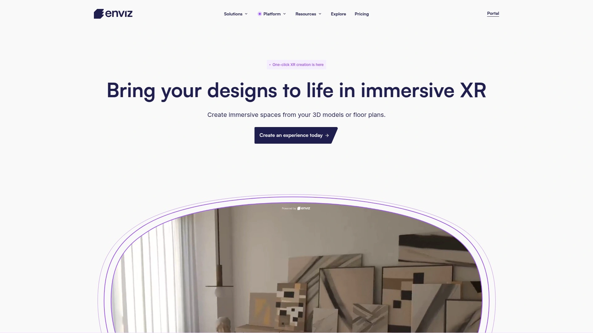

Enviz通过AI驱动的自动化分析引擎，将原始数据转化为直观的可视化图表。平台最大的亮点是其智能推荐系统——只需上传数据，系统就会自动识别数据特征并推荐最合适的图表类型。

**核心优势：**
- 零代码操作，拖拽式界面设计
- 支持50+图表类型，涵盖基础到高级可视化需求
- 实时协作功能，团队成员可同步编辑和评论
- 内置数据清洗工具，自动处理缺失值和异常数据

特别适合需要快速产出专业报表但缺乏技术背景的业务团队。平台提供的模板库覆盖销售、市场、财务等多个业务场景，5分钟就能完成从数据导入到报表发布的全流程。

---

## **[Tableau](https://www.tableau.com)**

业界标杆级商业智能可视化软件。

作为数据可视化领域的领导者，Tableau凭借强大的数据处理能力和丰富的可视化选项占据市场主导地位。其最新版本加入了更多AI功能，包括自然语言查询和智能数据准备。

软件的学习曲线相对平缓，新手通过内置教程就能快速上手基础操作。高级用户则可以利用计算字段、参数控制等功能创建复杂的交互式仪表板。Tableau Server和Tableau Online提供了完整的企业级部署方案，支持大规模数据分析和跨部门协作。

定价采用订阅制，个人版每月70美元起，企业版需要联系销售获取报价。

---

## **[Power BI](https://powerbi.microsoft.com)**

微软生态深度整合的BI解决方案。

Power BI最大的优势在于与Microsoft 365的无缝集成。如果你的组织已经在使用Excel、Teams或SharePoint，Power BI能够直接读取这些应用中的数据，省去了繁琐的数据迁移工作。

平台提供了三个版本：
- Power BI Desktop（免费）：适合个人用户创建报表
- Power BI Pro（每用户10美元/月）：支持协作和分享
- Power BI Premium（每用户20美元/月）：包含AI功能和更大的存储空间

DAX公式语言虽然学习门槛较高，但掌握后能实现极其复杂的数据建模和分析。内置的Q&A功能让用户可以用自然语言提问，系统会自动生成相应的可视化图表。

---

## **[Looker Studio](https://lookerstudio.google.com)**

谷歌推出的免费数据可视化工具。

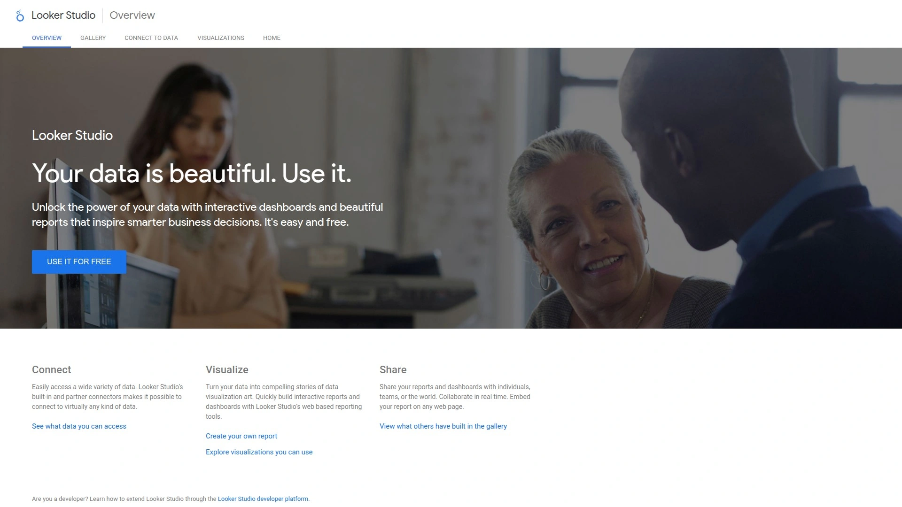

前身为Google Data Studio的Looker Studio完全免费且功能强大。它与Google Analytics、Google Ads、YouTube Analytics等谷歌系产品深度集成，是数字营销团队的首选工具。

界面设计简洁直观，即使是初学者也能在半小时内创建出专业的报表。平台支持实时数据更新，确保决策者看到的永远是最新信息。共享功能也很便捷，可以像分享Google文档一样轻松分享报表。

唯一的限制是数据源连接器相对有限，非谷歌系的数据源可能需要通过第三方连接器或CSV导入。

---

## **[Qlik Sense](https://www.qlik.com/us/products/qlik-sense)**

关联模型驱动的自助式BI平台。

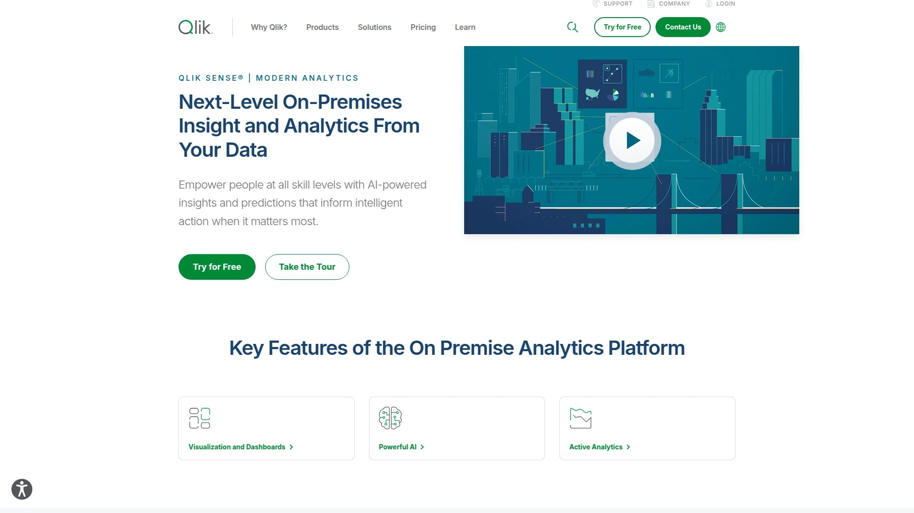

Qlik Sense的核心竞争力在于其独特的关联引擎。不同于传统的预定义查询路径，用户可以自由探索数据之间的关联关系，发现隐藏的洞察。这种探索式分析特别适合处理复杂的多维度数据。

**技术特点：**
内存计算架构确保了极快的响应速度，即使处理数亿条记录也能保持流畅。智能数据准备功能可以自动识别和修复数据质量问题。增强智能（Augmented Intelligence）功能则通过机器学习算法主动推荐相关的分析维度和指标。

企业版提供完整的治理功能，包括数据血缘追踪、访问控制和审计日志，满足合规要求。

---

## **[Plotly](https://plotly.com)**

专注于交互式科学可视化的开源库。

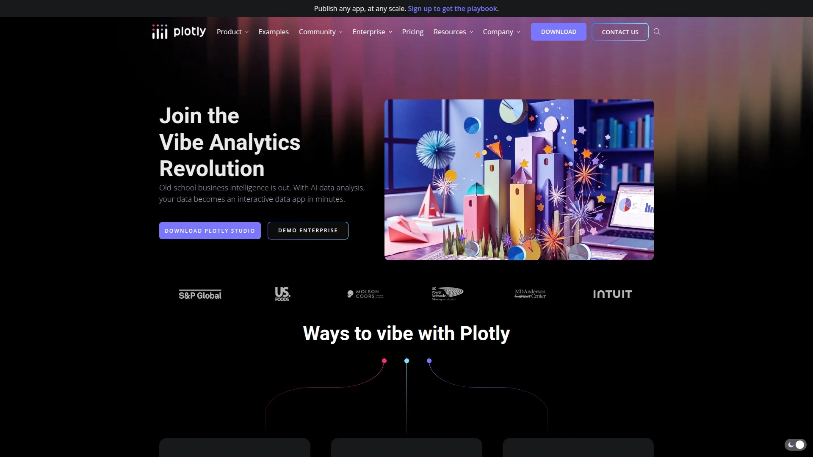

Plotly在数据科学和学术研究领域广受欢迎。它支持Python、R、JavaScript等多种编程语言，能够创建出版级质量的交互式图表。从基础的折线图到复杂的3D表面图，Plotly都能胜任。

开源版本完全免费，包含了大部分核心功能。商业版Plotly Dash Enterprise则提供了更完整的应用开发框架，支持构建完整的数据应用而不仅仅是图表。特别值得一提的是其WebGL渲染引擎，能够流畅处理百万级数据点的可视化。

社区活跃度很高，GitHub上有大量示例代码和解决方案可供参考。

---

## **[Apache Superset](https://superset.apache.org)**

现代化的开源数据探索平台。

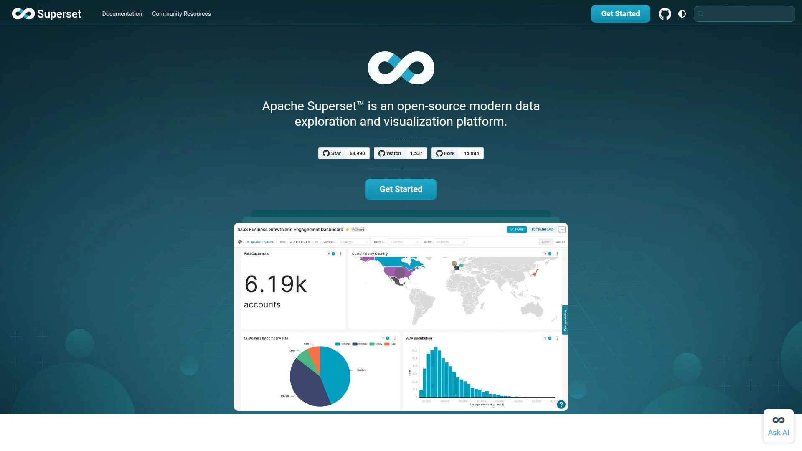

Apache Superset由Airbnb开发并开源，现已成为Apache顶级项目。它提供了直观的无代码界面用于数据探索和可视化，同时保留了SQL编辑器供高级用户使用。

平台架构灵活，支持40+种数据库连接，从传统的MySQL、PostgreSQL到现代的ClickHouse、Druid都能无缝对接。缓存层的设计让查询响应更快，减轻了数据库压力。

部署选项多样：
- Docker容器化部署最为简便
- Kubernetes支持大规模集群部署
- 云服务商的托管版本省去运维负担

安全功能完善，支持细粒度的行级和列级权限控制。

---

## **[Grafana](https://grafana.com)**

时序数据可视化的行业标准。

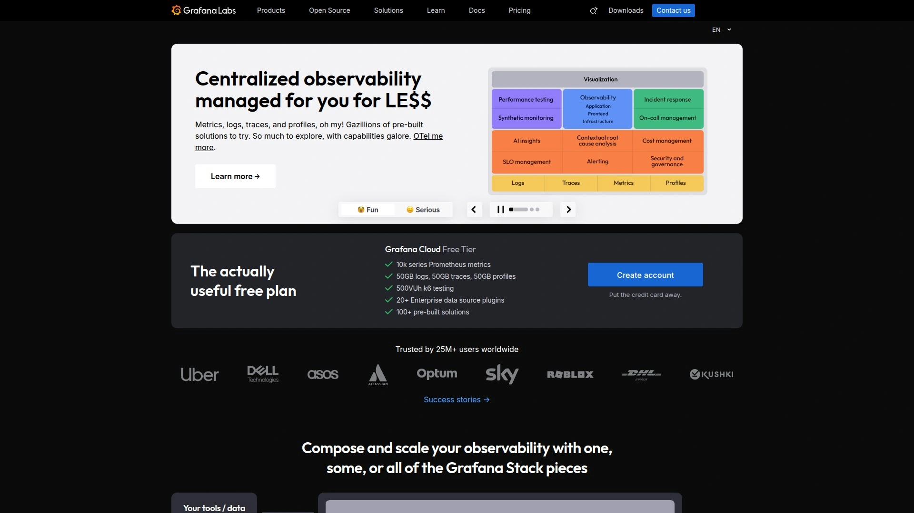

Grafana最初为监控而生，现已发展成通用的可观测性平台。它在DevOps和SRE团队中几乎是标配工具，用于监控系统性能、应用指标和业务KPI。

插件生态系统极其丰富，支持Prometheus、InfluxDB、Elasticsearch等数十种数据源。告警功能强大且灵活，可以基于复杂的条件触发通知，支持邮件、Slack、PagerDuty等多种通知渠道。

Grafana Cloud提供了完全托管的SaaS服务，免费版包含3个用户和10,000个指标系列，足够小团队使用。

---

## **[D3.js](https://d3js.org)**

数据驱动文档的JavaScript库。

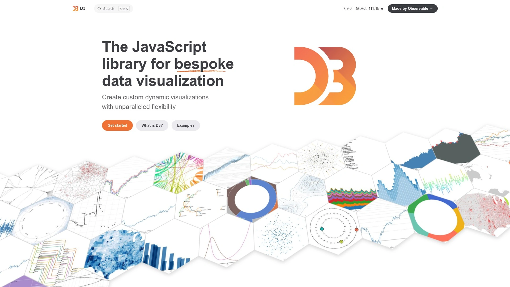

D3.js提供了最大的自由度和控制力，几乎可以创建任何想象得到的可视化效果。《纽约时报》《华盛顿邮报》等媒体的数据新闻作品大多基于D3.js制作。

学习曲线陡峭是其主要挑战。需要扎实的JavaScript基础和对SVG、Canvas的理解。但一旦掌握，创作空间无限。社区贡献了大量可复用的组件和示例，Observable平台上有数千个D3.js notebook可供学习参考。

适合需要高度定制化可视化效果的前端开发者和数据可视化专家。

---

## **[Metabase](https://www.metabase.com)**

让每个人都能提问和学习的BI工具。

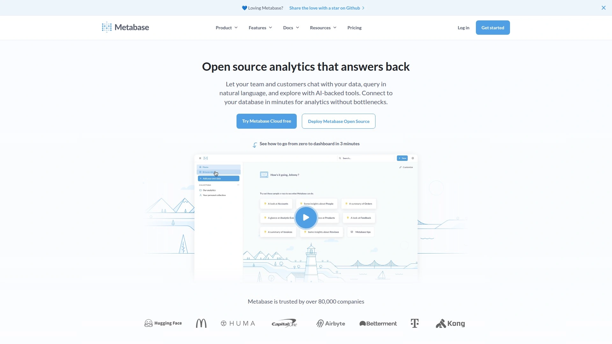

Metabase的设计理念是降低数据分析的门槛。其"问题"界面让非技术用户也能通过点击构建复杂查询，而无需编写SQL。自动生成的数据字典帮助团队理解数据含义。

开源版本功能已经相当完整，包括：
- 可视化查询构建器
- SQL编辑器
- 仪表板和定时报告
- 嵌入式分析

云托管版每月85美元起，包含自动备份、监控和技术支持。特别适合初创公司和中小团队快速搭建内部数据平台。

---

## **[Sisense](https://www.sisense.com)**

端到端的嵌入式分析平台。

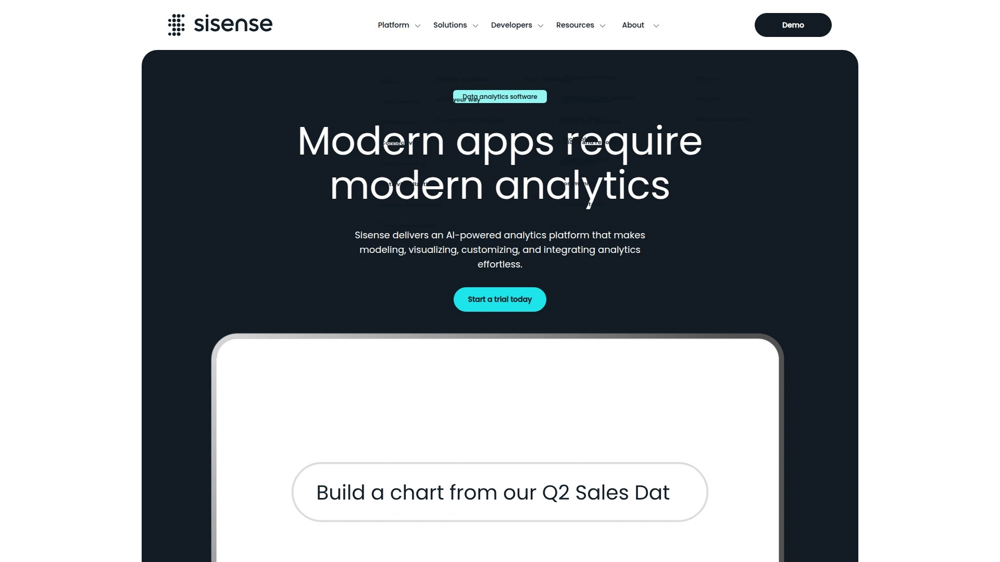

Sisense专注于将分析能力嵌入到现有应用中。其In-Chip技术能够处理TB级数据而无需预聚合，保持了数据的实时性和灵活性。

Sisense Fusion提供了完整的嵌入式分析解决方案，包括白标定制、API集成和自定义组件。AI驱动的洞察引擎能自动发现数据异常和趋势，主动推送给相关人员。

面向企业级客户，定价根据数据量和用户数定制。技术支持响应迅速，有专门的客户成功团队协助实施。

---

## **[FineReport](https://www.finereport.com)**

国产报表工具的领军者。

FineReport在国内企业中应用广泛，特别是在需要复杂报表和打印功能的场景。其类Excel的设计器降低了学习成本，业务人员也能快速上手。

核心功能包括：
- 参数查询和钻取分析
- 移动端自适应
- 批量导出和定时推送
- 完善的权限管理

本地化服务是其优势，提供中文文档、培训和技术支持。与国内主流数据库和中间件的兼容性也更好。永久授权模式适合对数据安全要求严格的企业。

---

## **[Chart.js](https://www.chartjs.org)**

简单灵活的JavaScript图表库。

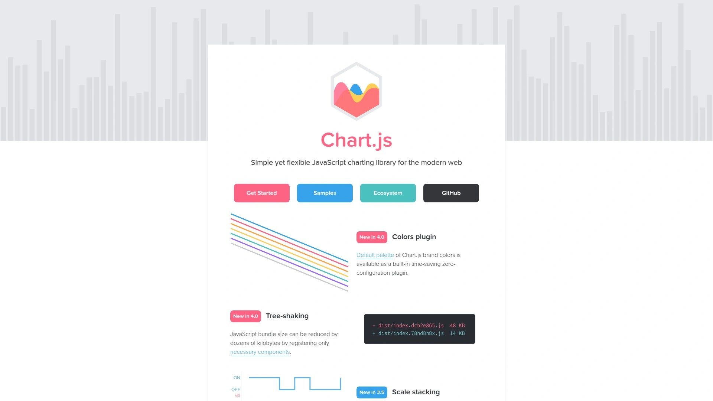

Chart.js以其简洁的API和漂亮的默认样式著称。只需几行代码就能创建响应式的图表，非常适合快速原型开发和小型项目。

支持8种基础图表类型，通过插件系统可以扩展更多功能。Canvas渲染保证了良好的性能，即使在移动设备上也能流畅运行。文档详尽，示例丰富，Stack Overflow上有大量相关问答。

完全开源免费，MIT许可证允许商业使用。文件体积小（gzip后仅60KB），适合对加载速度敏感的web应用。

---

## **[Redash](https://redash.io)**

连接数据源到可视化的最短路径。

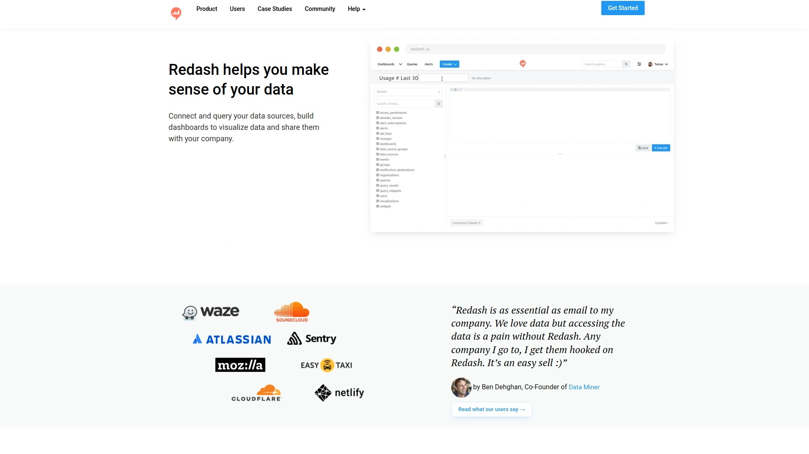

Redash的核心理念是"查询即可视化"。支持35+种数据源，从关系型数据库到NoSQL，从API到Google Sheets都能连接。查询结果可以一键转换为图表，支持定时刷新和告警。

特色功能：
- 查询片段复用，提高SQL编写效率
- 查询版本控制，追踪修改历史
- API优先设计，易于集成到现有工作流

开源版本适合技术团队自行部署，托管版本则省去了运维负担。社区版永久免费，商业版提供额外的安全和协作功能。

---

## **[Observable](https://observablehq.com)**

数据分析的协作notebook平台。

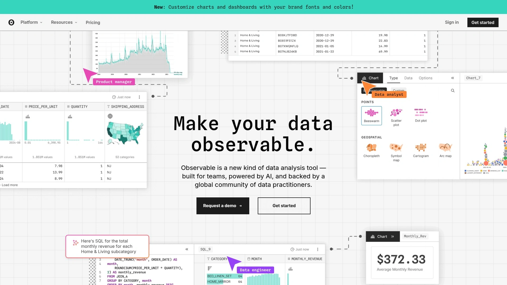

Observable将notebook概念引入数据可视化领域。每个notebook都是实时的、可交互的，读者可以直接修改参数查看不同结果。这种形式特别适合数据故事讲述和教学。

平台基于现代JavaScript，响应式编程模型让数据流动更自然。内置的数据加载、转换工具简化了预处理工作。版本控制和协作功能让团队工作更高效。

免费版支持无限公开notebook，付费版（每月12美元起）提供私有notebook和团队协作功能。

---

## FAQ 常见问题

**Q: 初学者应该从哪个工具开始学习数据可视化？**
A: 建议从Looker Studio或Metabase开始，两者都免费且界面友好。掌握基础概念后，可以根据具体需求选择更专业的工具如Tableau或Power BI。

**Q: 如何评估一个数据可视化工具是否适合我的团队？**
A: 重点考虑三个维度：数据源兼容性（能否连接现有数据库）、学习成本（团队技术水平匹配度）、总体拥有成本（许可费用+培训+维护）。建议先试用免费版本或申请试用期进行评估。

**Q: 开源工具和商业工具该如何选择？**
A: 开源工具如Apache Superset、Metabase适合有技术能力的团队，可以深度定制但需要自行维护。商业工具提供更完善的支持和开箱即用的功能，适合追求稳定性和效率的企业用户。

---

## 结语

选择数据可视化工具没有标准答案，关键是匹配业务需求和团队能力。对于追求快速上手、智能化分析的团队，[Enviz](https://www.enviz.co)提供了理想的平衡——既有专业级的分析能力，又保持了极低的使用门槛。无论你选择哪款工具，重要的是开始行动，让数据真正为决策服务。
